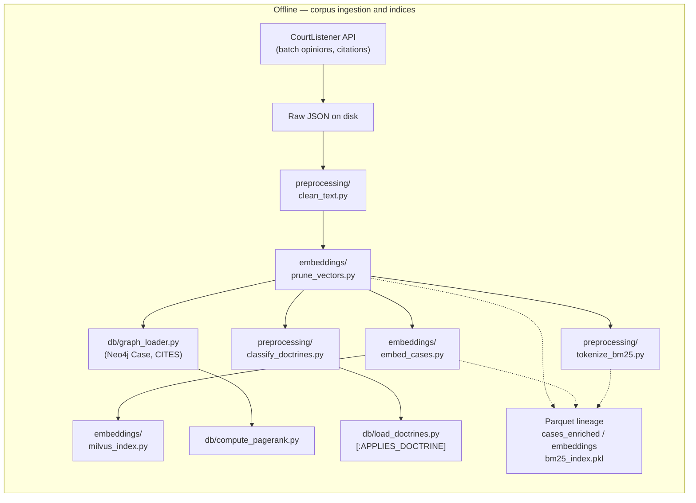
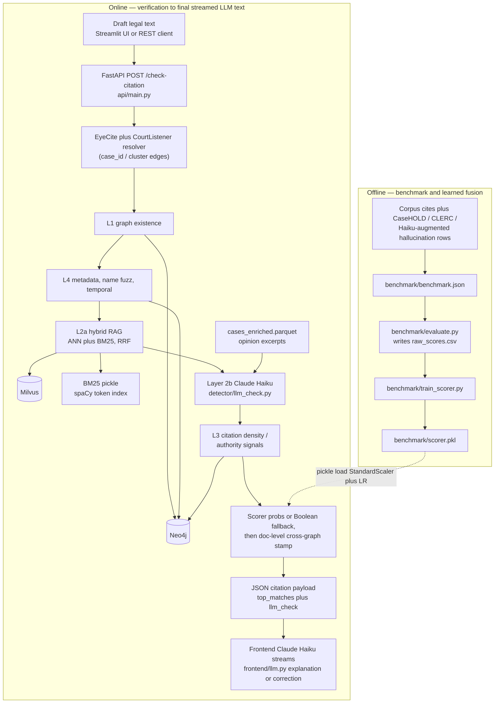

# Legal Citation Hallucination Detector

## Problem Framing

### Statement

LLMs hallucinate legal citations in 3 ways: completely fabricated case law, corrupted citation metadata (wrong court/wrong year) and citing real cases for propositions they do not support.

| Hallucination Type      | Description                                                                                         |
| ----------------------- | --------------------------------------------------------------------------------------------------- |
| **Fabricated (Type A)** | The cited case does not exist anywhere in the legal corpus                                          |
| **Misconnected (Type B)** | The case exists and is topically plausible but has corrupted metadata or a wrong proposition      |
| **Real but Irrelevant (Type C)** | The case exists but is semantically unrelated to the argument                              |

### Why it matters

Veracity and validity of LLM outputs are a major roadblock in the legal field and using incorrectly cited or correctly cited, but incorrectly explained citations in legal documents have real-world implications on both the case and the lawyer. Real-world sanctions have already been issued against lawyers who submitted AI-generated briefs without verifying their citations.

### Target Users

Lawyers, law firms and legal researchers

### Impact

Establish trust in implementing AI into legal brief writing. Unlike LexisNexis (a research tool for finding cases), Verit is a **verification tool**, it plugs into an AI writing pipeline and programmatically checks citations the way a linter checks code.

---

## Dataset Understanding

### Data Sources

- **CourtListener API** — Federal circuit court opinions filtered to Fourth Amendment / search & seizure, across all federal circuits
- **CLERC (Hugging Face)** — Pre-chunked U.S. legal case retrieval dataset; used as ground truth "real citation" half of the benchmark
- **CaseHOLD (AI2 / Hugging Face)** — Multiple-choice QA benchmark over U.S. legal holdings; used to evaluate citation relevance
- **Claude Haiku** — Generated fabricated and proposition-hallucinated citations for the benchmark dataset

### Size

- Pulled 2,000 cases within the 4th Amendment domain between 2010–2025 across two batches (post-2015 and 2010–2015)
- Criteria for dropping a case:
  - Opinion text only available as PDF (avoided PDF conversion noise)
  - Incomplete citation metadata
  - Incomplete court/year properties
  - Plain text under 200 characters (insufficient for meaningful embeddings)
- After cleanup: **1,353 cases** in corpus

### Structure

- **Raw data:** JSON from CourtListener API (batch ingestion, deduplicated on `case_id`)
- **Processed data:** Parquet files for pipeline consumption — `cases_enriched.parquet`, `cases_cleaned.parquet`, `cases_pruned.parquet`, `cases_tokenized.parquet`, `embeddings.parquet`
- **Graph:** 1,353 full nodes + 14,773 stub nodes + 30,806 `CITES` directed edges in Neo4j
- **Benchmark:** 835 citations — 418 real / 417 hallucinated (Type A: fabricated, Type B: corrupted metadata + proposition hallucination, Type C: plausible nonexistent)

### RAG/Graph Suitability

- Fourth Amendment doctrine has the richest and most interconnected citation network in federal case law, making graph traversal unusually powerful and visually compelling
- A small set of landmark anchor cases — *Terry v. Ohio*, *Katz v. United States*, *Mapp v. Ohio*, *United States v. Leon* — are cited by thousands of downstream opinions, creating clear hub nodes
- LLMs are known to confuse Fourth Amendment standards across contexts, making this an ideal domain for hallucination detection

### Preprocessing Steps

1. `preprocessing/clean_text.py` — stripped court headers/footers, normalized citation strings to `[CITATION]` token, encoding artifacts from CourtListener's HTML/text extraction
2. `embeddings/prune_vectors.py` — filtered corpus to cases with usable plain text (min 200 chars, max 50,000 chars)
3. `preprocessing/tokenize_bm25.py` — spaCy lemmatization with legal term preservation for BM25 index
4. `preprocessing/classify_doctrines.py` — classifies opinion text against Fourth Amendment concept keywords to assign doctrine tags
5. `embeddings/embed_cases.py` — paragraph chunking (512-token ceiling, 1-paragraph overlap), Legal-BERT inference, mean-pool token embeddings per chunk + L2-normalize → 768-dim vector per chunk; default mode further mean-pools chunk vectors → one vector per case; Phase 5 `--chunks` mode stores per-chunk vectors for max-pool aggregation at retrieval time

---

## System Architecture

### High Level Diagram

Per-citation path (runs in this order — Layer 4 before Layer 2a to avoid wasting LLM calls on doomed metadata mismatches):

```
AI-Generated Legal Text
        │
        ▼
 EyeCite Extraction     →  Parse citation strings → resolve to cluster IDs
        │
        ▼
 Layer 1 (Neo4j)       →  Case exists in graph? No → HALLUCINATED (stop)
        │
        ▼
 Layer 4 (Metadata)     →  Cited year/court match Neo4j node?
        │                   Mismatch → HALLUCINATED (stop)
        ▼
 Name Check             →  Party names vs node title (rapidfuzz)
 Temporal Check         →  Cited vs actual decision year (uses L4 fields)
        │                   Signals for fusion below (not standalone hard stops)
        ▼
 Layer 2a (Milvus+RAG) →  Corpus relevance: hybrid dense ANN + sparse BM25, RRF
        │
 Layer 2b (Claude, if 2a passes) →  Proposition vs holding (skipped when 2a fails)
        │                              LLM rejects → **SUSPICIOUS** before scorer fusion
        ▼
 Layer 3 (Neo4j graph) →  Connectivity: shared-citation density + PageRank-derived score
        │
        ▼
 Learned scorer         →   If `benchmark/scorer.pkl` present:
        │                   StdScaler + logistic regression over **7** features
        │                   (`rrf`, dense, case_sim, density, pagerank, name, temporal)
        │                   → P(hallucinated); thresholds 0.40 / 0.70
        │                   If no model: Boolean AND of L2a + L3 + name_ok + temporal_ok
        ▼                         (+ L2b not failed when it ran)

 Per-citation VERDICT: REAL | SUSPICIOUS | HALLUCINATED
```

After **all** citations are scored (≥2 cites that survived L1):

```
 Document-level stamping (Neo4j; does NOT change verdict or feed the LR model)
 Cross-citation         →  Mean Jaccard of co-citation neighborhoods;
                           shortest-hop distance between cites in citation graph;
                           doctrine overlap ([:APPLIES_DOCTRINE] signals attached to payload)
        │
        ▼
 API / UI payload       →  Per-citation verdict + layer signals + stamped cross-graph fields

 Example fields returned:
 { "verdict": "REAL" | "SUSPICIOUS" | "HALLUCINATED",
   "exists": bool,
   "semantic": RRF/cosine/case_sim, "density_score", "pagerank_score",
   "cross_jaccard_score": float?, "mean_shared_doctrines": float?,
   "llm_check": { "is_accurate": bool, "reason": str }? }
```

### Data Flow

1. Raw AI-generated legal text enters via `POST /check-citation` (FastAPI)
2. EyeCite extracts citation strings → CourtListener resolves each to a cluster ID
3. Each citation runs **Layers 1 → 4 → Name/Temporal → 2a → (optional) 2b → 3 → fusion** (LR **or** boolean fallback)
4. With `scorer.pkl`: **seven** calibrated features (everything that can still vary after L1+L4 gates) → `P(hallucinated)`; without it, `detector/pipeline.py` falls back to Boolean AND/OR rules over Layers 2a/3 and the name/temporal checks
5. If the document has two or more L1-surviving cites, Neo4j **cross-citation + doctrine coherence** signals are stamped onto each verdict for explanation / dashboards
6. Final payload is returned to the Streamlit frontend

**Verdict logic (production pipeline):**

- Layer 1 FAIL → **HALLUCINATED** immediately
- Layer 4 FAIL → **HALLUCINATED** immediately
- Layer 2b ran **and** rejected the proposition → **SUSPICIOUS** immediately (scorer skipped for that shortcut)
- Remaining cites: **`scorer.pkl` loaded**
  - `P(hallucinated) < 0.40` → **REAL**
  - `0.40 ≤ P(hallucinated) < 0.70` → **SUSPICIOUS**
  - `P(hallucinated) ≥ 0.70` → **HALLUCINATED**
- **`scorer.pkl` missing**: **REAL** only if Layer 2a + Layer 3 + name + temporal checks all pass **and** Layer 2b did not reject; otherwise **SUSPICIOUS**

### End-to-end data flow — ingestion → final LLM output

Verit separates **offline corpus assembly** from **online verification**. The **first** LLM calls are **benchmark generation** (synthetic hallucination rows); at serve time **Layer 2b** Claude scores proposition accuracy against `cases_enriched.parquet`; the **final** streamed lawyer-facing prose comes from **frontend** Claude (`frontend/llm.py`) grounded in retrieval `top_matches` and verdict JSON.





**Reading the charts**

- **Ingestion** produces the Parquets, BM25 artifact, Neo4j property graph (plus doctrine edges and pagerank-loaded fields), and Milvus dense index used at query time.
- **Runtime**: the API orchestrates deterministic checks + retrieval; **Layer 2b** is an LLM that reads corpus opinion text (`cases_enriched.parquet`), not arbitrary web grounding.
- **Final LLM output**: after JSON returns to Streamlit, a **second** Haiku session streams an explanation (or hallucination-oriented correction suggestion) using the same **`top_matches`** RAG context bundled in the API response.

---

## RAG/Graph Structure

### RAG

#### Chunking

- Paragraph-level chunking with a 512-token ceiling and 1-paragraph overlap
- Applied to `cases_cleaned.parquet` (HTML-stripped, citation-normalized text)
- Chunk-level embeddings stored in Milvus (Phase 5 rebuild); ANN hits aggregated via max-pooling per case

#### Metadata

Each Milvus vector stores: `case_id`, `cluster_id`, `court_id`, `year`, `chunk_index`

Runtime retrieval currently uses the full corpus (no circuit/jurisdiction filter at query time).

#### Indexing

- **Dense index:** HNSW in Milvus (M=16, ef_construction=200) — 1,353 cases × 768-dim Legal-BERT vectors
- **Sparse index:** BM25Okapi over spaCy-lemmatized tokens (`data/processed/bm25_index.pkl`, 5.7 MB)
- Both combined via **Reciprocal Rank Fusion (RRF)** — no weight tuning required, robust by default
- **Phase 5:** Milvus reindexed at chunk level (`embeddings_chunked.parquet`); `semantic_check.py` aggregates multiple chunk hits per case using **max-pooling** (best-chunk score wins) before RRF fusion

### Graph

#### Nodes

| Node Type | Count | Description |
| --------- | ----- | ----------- |
| `Case` (full) | 1,353 | Corpus cases with full opinion text and metadata |
| `Case` (stub) | 14,773 | Out-of-corpus cases cited by the corpus; minimal node (ID only) |
| `Case` (landmark) | 5 | SCOTUS anchors: *Terry*, *Katz*, *Mapp*, *Leon*, *Gates* (`landmark: true`) |
| `Doctrine` | varies | Named Fourth Amendment concept nodes (e.g., `reasonable_expectation_of_privacy`, `good_faith_exception`, `warrant_requirement`, `stop_and_frisk`) |

#### Edges

| Edge | Description |
| ---- | ----------- |
| `[:CITES]` | Directed citation from citing case to cited case (30,806 total) |
| `[:APPLIES_DOCTRINE]` | Links a `Case` node to a `Doctrine` node based on keyword classification of opinion text (Phase 5) |

#### Properties

Key properties on `Case` nodes: `case_id`, `cluster_id`, `name`, `court_id`, `year`, `cite_count`, `pagerank`, `landmark`, `stub`

`pagerank` computed via pure-Python power iteration (damping=0.85, max_iter=100) — no Neo4j GDS plugin required

#### Doctrine Ontology (Phase 5)

The doctrine layer is the graph's semantic intelligence layer. Rather than treating all `[:CITES]` edges as equivalent, `Doctrine` nodes capture *what legal concept* a case actually addresses — allowing the detector to reason about whether cited cases are doctrinally coherent, not just citation-network-connected.

**How doctrines are assigned (`preprocessing/classify_doctrines.py`):**

Each case's `plain_text` is scanned against a keyword vocabulary for each Fourth Amendment concept. If enough matching terms appear, a `[:APPLIES_DOCTRINE]` edge is written from the `Case` node to the corresponding `Doctrine` node in Neo4j (`db/load_doctrines.py`). This is purely text-based classification — no LLM call, no external API.

Example doctrine concepts and their keyword signals:

| Doctrine | Example Keywords |
| -------- | ---------------- |
| `reasonable_expectation_of_privacy` | "reasonable expectation", "Katz", "privacy interest" |
| `good_faith_exception` | "good faith", "Leon", "objectively reasonable" |
| `warrant_requirement` | "warrant", "probable cause", "magistrate" |
| `stop_and_frisk` | "Terry stop", "articulable suspicion", "pat-down" |
| `exigent_circumstances` | "exigent", "emergency", "hot pursuit" |

**How doctrine coherence is used (`detector/doctrine_check.py`):**

After per-citation scoring, the pipeline checks whether the citations in a document share overlapping doctrine tags. A coherent legal brief should have doctrinal unity — cases about stop-and-frisk should co-cite other stop-and-frisk cases, not cases about digital privacy or exigent circumstances.

```cypher
MATCH (c:Case {cluster_id: $id})-[:APPLIES_DOCTRINE]->(d:Doctrine)
RETURN collect(d.name) AS doctrines
```

The `doctrine_check` module returns:
- `has_doctrines: bool` — whether the case has any doctrine tags at all
- `mean_shared_doctrines: float` — average doctrine overlap across all citation pairs in the document

**Why this matters for hallucination detection:**

A hallucinated citation inserted into a brief about the warrant requirement may cite a real case — but one that only discusses the good faith exception. The case *exists*, its *metadata is valid*, and its *semantic score* is plausible (both are Fourth Amendment). The only signal that something is wrong is that its doctrine tag doesn't match the document's doctrinal context. This is the failure mode that `[:APPLIES_DOCTRINE]` is specifically designed to catch.

---

## Technical Implementation

### Key Configuration Hyperparameters

| Parameter | Config Key | Tuned Value | Notes |
| --------- | ---------- | ----------- | ----- |
| Cosine similarity floor | `SIMILARITY_THRESHOLD` | 0.60 | Tuned on 400-entry validation set |
| RRF score floor | `RRF_THRESHOLD` | 0.010 | Minimum — Layer 2a permissive by design |
| Citation density minimum | `CITATION_DENSITY_THRESHOLD` | 1 | Minimum — Layer 3 augments scorer, not standalone verdict |
| Party name match floor | `NAME_SCORE_THRESHOLD` | 0.70 | Below → SUSPICIOUS signal |
| Hallucinated threshold | — | P ≥ 0.70 | Learned scorer output |
| Suspicious threshold | — | P ≥ 0.40 | Learned scorer output |

### Embedding Design

- **Model:** `legal-bert-base-uncased` — domain-adapted BERT pre-trained on legal corpora
- **Within-chunk pooling:** mean-pool BERT token embeddings over non-padding positions → 768-dim vector per chunk (more robust than CLS-only for longer documents)
- **Case-level pooling (default):** chunk vectors are mean-pooled → one 768-dim vector per case stored in Milvus
- **Phase 5 chunk mode:** chunk vectors stored individually; at retrieval time, `semantic_check.py` max-pools ANN scores across all chunks belonging to the same case (best-matching chunk score represents the case)
- **Normalization:** L2-normalized before Milvus storage so cosine similarity = dot product
- **Truncation:** `MAX_TEXT_LENGTH = 50,000` chars applied before chunking — Fourth Amendment opinions front-load doctrinal reasoning; tail content is procedural boilerplate
- **Batch size:** `EMBED_BATCH_SIZE = 32` for CPU inference
- **Windows DLL fix:** `import torch` must precede `numpy`/`pandas` imports (WinError 1114 c10.dll conflict)

### Vector Store/Graph Queries

**Hybrid ANN + BM25 via RRF (Layer 2a):**
1. Dense: Milvus HNSW query → top-K cosine neighbors (`TOP_K=5`)
2. Sparse: BM25Okapi query over spaCy-lemmatized tokens → top-K matches
3. RRF fusion: `1 / (rank + RRF_K)` summed per document, ranked by fused score

**Neo4j citation density (Layer 3):**
```cypher
MATCH (target:Case {cluster_id: $id})-[:CITES]->(shared)<-[:CITES]-(corpus:Case)
WHERE corpus.stub = false
RETURN count(DISTINCT corpus) AS density, target.pagerank AS pagerank
```

**Doctrine coherence (Phase 5):**
```cypher
MATCH (c:Case {cluster_id: $id})-[:APPLIES_DOCTRINE]->(d:Doctrine)
RETURN collect(d.name) AS doctrines
```

---

## Evaluation

### Metrics

#### Final Architecture — Test Set (held-out 167 entries, 835-entry benchmark)

| Layer | Precision | Recall | F1 |
| ----- | --------- | ------ | -- |
| Layer 1 — Existence | 1.000 | 0.517 | 0.682 |
| Layer 2a — Semantic | 0.000 | 0.000 | 0.000 |
| Layer 2b — LLM Prop | 1.000 | 1.000 | 1.000 |
| Layer 3 — Connectivity | 1.000 | 0.095 | 0.174 |
| Layer 4 — Metadata | 1.000 | 0.794 | 0.885 |
| **Combined** | **1.000** | **0.931** | **0.964** |

Subtype F1: A=1.000, B=0.923, C=1.000 — Zero false positives.

#### Final Architecture — 10-Fold Cross-Validation (835 entries)

| Layer | Precision | Recall | F1 |
| ----- | --------- | ------ | -- |
| Layer 1 — Existence | 1.000 ± 0.000 | 0.520 ± 0.007 | 0.684 ± 0.006 |
| Layer 2a — Semantic | 0.000 ± 0.000 | 0.000 ± 0.000 | 0.000 ± 0.000 |
| Layer 2b — LLM Prop | — | — | — |
| Layer 3 — Connectivity | 1.000 ± 0.000 | 0.120 ± 0.055 | 0.210 ± 0.088 |
| Layer 4 — Metadata | 1.000 ± 0.000 | 0.862 ± 0.085 | 0.924 ± 0.049 |
| **Combined** | **1.000 ± 0.000** | **0.954 ± 0.033** | **0.976 ± 0.017** |

Fold F1 range: 0.951 – 1.000. Zero false positives across all folds.

> **Note on Layer 2a:** Scores 0.000 in isolation in both benchmark versions — its RRF threshold is permissive enough that every `exists=True` entry passes. Layer 2a's role is a cheap domain pre-filter before the LLM call, not a standalone verdict signal.
>
> **Note on Layer 2b:** Not shown separately in CV output — contribution captured in the combined recall improvement (0.520 → 0.954). Per-fold estimates too noisy (~3–4 proposition cases/fold); held-out test result (F1=1.000, TP=7, FP=0, FN=0) is the authoritative measurement.

### Failure Cases

- **Six FNs in test set** — all Type B metadata-corruption cases with high RRF scores (0.031–0.033) and high connectivity density (22–29). Semantic and connectivity signals actively passed them as REAL; Layer 4 either did not check them or validated them correctly. These represent the "hard case": a metadata-corrupted citation whose corpus signals are indistinguishable from a legitimate one.
- **benchmark_id=171 (historical)** — Type B year-corrupted citation where the Neo4j node stores the same incorrect year (2025) as the benchmark injection. Layer 4 compares `2025 == 2025`, finds no mismatch, passes it. Corpus data quality issue; structurally undetectable by Layer 4.
- **Layer 4 recall variance (±0.085 in CV)** — caused by folds containing Type B entries where the corrupted year matches the node's stored year, or the corrupted court ID happens to match the node's actual court.

### Limitations

1. **Proposition hallucination is now partially addressed** — Layer 2b (LLM check) detects cases where a real citation is attributed a fabricated or inverted holding, achieving F1=1.000 on the proposition-subtype test set.
2. **Layer 4 depends on corpus data quality** — if Neo4j stores an incorrect year, Layer 4 cannot detect a matching year corruption.
3. **Layers 2a and 3 show F1=0.0 in isolation** — not a failure; every hallucinated citation reaching those layers is Type B with valid semantic/connectivity signals from the real underlying case. These layers provide redundancy for edge cases outside this benchmark's scope.
4. **Corpus coverage gap** — 369 cases missing citation strings (non-standard reporters); landmark cases (e.g., *Terry v. Ohio*) return `density_score=0` because they are SCOTUS cases not present in the federal circuit corpus.

---

## Innovation

### Hybrid Search

Layer 2a combines two retrieval paradigms into a single relevance signal:

- **Dense ANN (Milvus HNSW):** captures semantic similarity — finds cases with related legal reasoning even when surface vocabulary differs
- **Sparse BM25:** captures keyword precision — finds cases sharing exact legal terms, case names, and doctrine vocabulary

Both searches run independently, then their ranked lists are fused. Neither alone is sufficient: dense search misses exact term matches; BM25 misses paraphrase and synonym relationships.

### Reranking via RRF

Reciprocal Rank Fusion (RRF) merges the dense and sparse ranked lists without requiring any weight tuning:

```
RRF_score(doc) = Σ 1 / (rank_i + RRF_K)
```

- **No hyperparameter sensitivity** — robust across diverse query types by design
- **Rank-based, not score-based** — avoids incompatible scale normalization between cosine similarity and BM25 scores
- `RRF_K=60` (standard), `TOP_K=5` — scores cluster in a narrow band (~0.023–0.025) by structural design, not a bug

### Feature Reduction

The learned scorer (Phase 3) replaces hand-coded threshold logic with logistic regression trained on **seven** feature signals—the ones that **still vary after** Layers 1 and 4 (`exists` **true**, `metadata_valid` **true**) at inference time. Training rows are filtered to that same scorer-reachable subset (`benchmark/train_scorer.py`) so coefficients are not dominated by invariant columns.

| Feature | Source |
| ------- | ------- |
| `rrf_score` | Layer 2a — hybrid ANN + BM25 (RRF) |
| `dense_score` | Layer 2a — top cosine similarity |
| `case_sim` | Layer 2a — case-specific cosine |
| `density_score` | Layer 3 — shared citation count |
| `pagerank_score` | Layer 3 — authority weighting |
| `name_score` | Name check — party name fuzzy match |
| `temporal_valid` | Temporal check — encoded as numeric for the scaler |

Older pickles trained on nine columns (including `exists` / `metadata_valid`) still load at inference; `detector/pipeline.py` trims the feature vector if needed.

- Trained with `class_weight=balanced` to handle imbalanced hallucination subtypes
- 5-fold stratified CV AUC reported during training; final model saved as `benchmark/scorer.pkl`
- Outputs a calibrated `P(hallucinated)` probability rather than a binary verdict, enabling the SUSPICIOUS intermediate class
