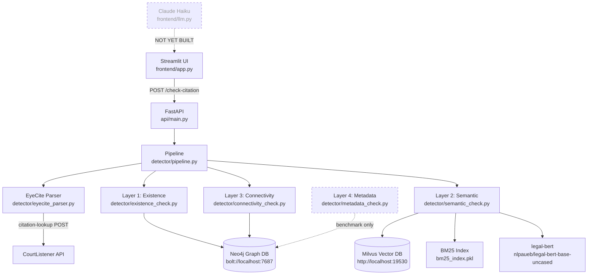

# Verit — Project Evaluation

> **Scope:** This evaluation is grounded in a direct audit of every source file in the repository. Where documentation and code diverge, the code is treated as source of truth.

---

## Executive Summary

**Verit** is a programmatic legal citation hallucination detector targeting Fourth Amendment federal case law. It verifies AI-generated citations using a four-layer pipeline: graph existence (Neo4j), semantic relevance (Milvus + BM25), citation network connectivity (Neo4j), and metadata cross-validation (year/court string matching). It exposes a FastAPI endpoint and a basic Streamlit UI.

The backend pipeline, infrastructure, and benchmark evaluation framework are all fully implemented and operationally complete. Two major components remain unbuilt: the Claude Haiku LLM explanation layer (`frontend/llm.py`) and the UMAP visualization module (`visualization/`). The Streamlit frontend is functional but limited to verdict badges — no LLM explanations and no confidence scores are surfaced.

**Critical findings from code audit:** The system's technology choices (Neo4j, Milvus) are substantially over-engineered for a 1,358-case corpus. Layer 3's connectivity signal is effectively at-floor (threshold tuned to density ≥ 1). Layer 2 measures domain-style matching, not citation accuracy. Verdict fusion discards all continuous scores into three string labels with no calibrated probability. Layer 4 (the most accurate layer in isolation) is not wired into the production pipeline. The benchmark F1=1.0 result reflects 40 entries engineered to be detectable by the current architecture — it does not generalize to subtle real-world hallucinations.

---

## 1. What the System Actually Does

### Input Path

A user submits raw AI-generated legal text to `POST /check-citation`. The API validates input size (≤50,000 chars) then calls `run_pipeline(text)` in `detector/pipeline.py`.

### Citation Extraction

`detector/eyecite_parser.py` runs EyeCite over the raw text, targeting only `FullCaseCitation` objects (short-form cites like `id.` and `supra` are explicitly skipped). Each full citation is then resolved to a CourtListener **cluster ID** via `POST /api/rest/v4/citation-lookup/`. The cluster ID is the shared key that links EyeCite output to Neo4j nodes — this is an important implementation detail: the graph was loaded using `case_id` (cluster ID), not opinion ID.

A 3-sentence context window is extracted around each citation string for downstream semantic search.

### Detection Pipeline (per citation)

```
FullCaseCitation (EyeCite)
        │
        ▼
 CourtListener citation-lookup → cluster_id
        │
        ▼
 Layer 1: Neo4j — MATCH (c:Case {id: $cluster_id})
        │  FAIL → HALLUCINATED (short-circuit)
        │
        ▼
 Layer 4: Neo4j — compare year + court from citation string
         vs. c.year + c.court_id stored on node
        │  MISMATCH → HALLUCINATED
        │
        ▼
 Layer 2: Milvus HNSW (dense) + BM25 (sparse) → RRF fusion
         determines is_relevant (rrf_score ≥ RRF_THRESHOLD)
        │
        ▼
 Layer 3: Neo4j citation density query
         MATCH (target)-[:CITES]→(shared)←[:CITES]-(corpus:Case {stub:false})
         determines is_connected (density ≥ CITATION_DENSITY_THRESHOLD)
        │
        ▼
 Verdict fusion:
   L2 ∧ L3 → REAL
   ¬L2 ∧ ¬L3 → HALLUCINATED
   L2 ⊕ L3 → SUSPICIOUS
```

> **Important gap from the code:** Layer 4 (`metadata_check.py`) is fully implemented and used inside `benchmark/evaluate.py`, but it is **not wired into `detector/pipeline.py`**. The live API pipeline runs only Layers 1, 2, and 3. Layer 4 exists exclusively in the offline benchmark evaluation loop. This means the production endpoint cannot catch Type B hallucinations (real case, wrong metadata) that the benchmark shows it can catch.

### Verdict Logic (from `pipeline.py`)

| Layer 1 | Layer 2 | Layer 3 | Verdict |
|:---|:---|:---|:---|
| FAIL | — | — | HALLUCINATED |
| PASS | PASS | PASS | REAL |
| PASS | FAIL | FAIL | HALLUCINATED |
| PASS | PASS | FAIL | SUSPICIOUS |
| PASS | FAIL | PASS | SUSPICIOUS |

---

## 2. System Architecture



---

## 3. Graph Ontology, Data Model & Confidence Matching

### 3.1 Node Schema

The Neo4j graph has a single node label — `Case` — with the following properties:

| Property | Type | Set By | Meaning |
|:---|:---|:---|:---|
| `id` | `int` | `graph_loader.py` | CourtListener cluster ID — the primary key shared with all other stores (Milvus, BM25, parquet) |
| `name` | `string` | `graph_loader.py` | Human-readable case name (e.g. `"United States v. Jones"`) |
| `year` | `int \| null` | `graph_loader.py` | 4-digit year from `date_filed` field |
| `court` | `string` | `graph_loader.py` | CourtListener `court_id` string (written as `c.court`, not `c.court_id`) |
| `court_id` | `string` | `backfill_court_id.py` | Canonical CourtListener court identifier used by Layer 4 — written in a separate migration pass |
| `stub` | `bool` | `graph_loader.py` | `false` → full corpus case with text; `true` → out-of-corpus case that exists only to anchor citation edges |
| `landmark` | `bool` | `fetch_landmarks.py`, `graph_loader.py` | `true` on the 5 SCOTUS landmark cases (Terry, Katz, Mapp, Leon, Gates) |

**Key design constraint:** `court` and `court_id` are distinct properties on the same node because they were written in separate ingestion passes. Only `court_id` is used by Layer 4 (`metadata_check.py`), meaning Layer 4 is functionally disabled until `backfill_court_id.py` has been run. This split is an implementation artifact, not a design intent.

### 3.2 Edge Schema

```
(Case)-[:CITES]->(Case)
```

There is exactly one relationship type: `CITES`. It is directed (from citing case to cited case). No properties are stored on edges — the edge represents the legal-citation graph as a pure directed graph. Edges are written idempotently via `MERGE`.

**Stub node strategy:** When case A cites case B and case B is not in the corpus, a minimal stub node is created for B (`stub: true`). This preserves citation topology for Layer 3 without requiring full text ingestion of out-of-corpus cases. The 14,773+ stub nodes form the extended citation neighborhood that Layer 3 traverses.

### 3.3 Graph Load Sequence (4 Stages)

`db/graph_loader.py` ingests from `cases_enriched.parquet` in four explicit, ordered stages that matter for correctness:

```
Stage 1 — Full Case nodes (MERGE on id, SET name/year/court/stub=false)
Stage 2 — Citation edges (pass 1: memory collection → pass 2: stub writes → pass 3: MERGE edges)
Stage 3 — Landmark flags (SET c.landmark=true on 5 SCOTUS IDs)
Stage 4 — Graph verification (counts, landmark names)
```

Stub nodes are written in Stage 2 *before* edges — this guarantees the `MATCH` in `_batch_upsert_citations` will always find both endpoints. The two-pass edge loading (collect-all-in-memory, then write stubs, then write edges) avoids interleaved upsert ordering bugs.

After Stage 4, running `db/backfill_court_id.py` writes `court_id` to all corpus nodes from the parquet source, enabling Layer 4.

### 3.4 Graph-Enabled Matching at Each Layer

The graph participates directly in two of the four detection layers:

#### Layer 1 — Existence (Graph as Ground-Truth Lookup)

```cypher
MATCH (c:Case {id: $cluster_id}) RETURN c.id LIMIT 1
```

The graph acts as an authoritative index of known Fourth Amendment cases. A citation's cluster ID (resolved via CourtListener's API) is either in the graph or it isn't. This is the hardest gate: a completely fabricated case ID fails immediately. The graph's completeness (1,358 full nodes + 14,773+ stubs) defines the boundary of the known legal universe.

**Confidence contribution:** binary. Pass → proceed; fail → `HALLUCINATED`, pipeline short-circuits.

#### Layer 3 — Citation Connectivity (Graph as Network Signal)

```cypher
MATCH (target:Case {id: $id})-[:CITES]->(shared)<-[:CITES]-(corpus:Case {stub: false})
RETURN count(DISTINCT shared) AS density
```

This query counts the number of distinct cases that are cited by both the target case *and* at least one full corpus case. The intuition: a real, impactful Fourth Amendment case will share many citation targets with other corpus cases — it participates in the same scholarly conversation about the same precedents. A hallucinated case has no citation footprint.

The `{stub: false}` constraint is critical — it restricts the "other side" of the co-citation relationship to full corpus cases, not stubs. This prevents spurious density inflation from out-of-corpus cases that happen to be cited by many others.

**Confidence contribution:** `density_score` (integer count) → thresholded by `CITATION_DENSITY_THRESHOLD` (tuned to 1 from the evaluation sweep). Output is `is_connected: bool`.

#### Layer 4 — Metadata Validation (Graph as Attribute Store)

```cypher
MATCH (c:Case {id: $id})
RETURN c.year AS year, c.court_id AS court_id
LIMIT 1
```

Layer 4 re-fetches node properties from the graph after Layer 1 has already confirmed existence. It uses the graph as a structured attribute store to cross-validate the year and court string in the raw citation against the ground-truth properties on the node.

This catches **Type B hallucinations**: cases where the cited case genuinely exists in the graph (Layer 1 passes) and is semantically relevant (Layer 2 passes) and is well-connected (Layer 3 passes), but the year or court in the citation string is wrong — a more subtle form of hallucination that only the structured metadata on the graph node can detect.

**Confidence contribution:** `is_valid: bool`. A mismatch on any available check (year, court, or both) sets `is_valid=False`. The `MetadataResult` dataclass also preserves the individual `year_match` and `court_match` booleans and the raw extracted vs. actual values for explanation purposes.

### 3.5 Court Alias Ontology

`metadata_check.py` includes a hand-authored ontology mapping natural-language court strings to canonical CourtListener `court_id` values:

```python
COURT_ALIASES = {
    "ca1":  ["1st cir", "first circuit"],
    "ca2":  ["2nd cir", "second circuit"],
    ...
    "ca9":  ["9th cir", "ninth circuit"],
    "cadc": ["d.c. cir", "dc cir"],
    "cafc": ["fed. cir", "federal circuit"],
}
```

This alias table performs a controlled vocabulary normalization: free-text citation parentheticals (e.g. `"(9th Cir. 2019)"`) are mapped to canonical IDs (e.g. `"ca9"`) before comparing against the `court_id` property on the Neo4j node. Two extraction strategies are tried in order:

1. **Bare court_id match** — catches benchmark-style corruptions where a raw `court_id` string (e.g. `"ca11"`) was injected directly into the trailing parenthetical
2. **Alias match** — catches natural-language court strings in formatted citations

This alias table is the system's only domain-specific ontology layer. It is static (not learned) and covers all 13 federal circuit courts.

### 3.6 Graph + Semantic Matching: Intended vs. Actual Signal

The verdict fusion model was designed to combine complementary signals from graph structure and semantic retrieval:

```
Layer 1 (Graph existence):    binary gate — HALLUCINATED if fail
Layer 2 (Semantic/Vector):    rrf_score → is_relevant (float threshold, booleanized)
Layer 3 (Graph connectivity): density_score → is_connected (count threshold, booleanized)
```

In theory, graph and vector signals are complementary:

| Dimension | Graph (L1 + L3) | Vector Store (L2) |
|:---|:---|:---|
| **Intended signal** | Structural existence + citation network footprint | Semantic domain consistency |
| **Actual signal** | Key-value lookup (L1) + shared-neighbor count (L3) | Domain-style matching, not citation accuracy |
| **Practical weakness** | L3 threshold tuned to 1 — borderline noise at this corpus scale | Fabricated citations in authentic prose score high; real cross-domain cites score low |

**Important limitation:** All continuous scores (rrf_score, density_score) are collapsed to booleans before fusion. The verdict is then three-way AND/OR logic on those booleans — `rrf_score 0.021` and `rrf_score 0.95` produce identical verdicts. No calibrated confidence score is exposed in the API or UI. See §8 for the full critique.

---

## 4. Component Audit — What Is Actually Built

### ✅ Data Pipeline

| Script | Status | Notes |
|:---|:---|:---|
| `data/fetch_cases.py` | ✅ Built | CourtListener pull for Fourth Amendment cases |
| `data/fetch_all_opinions.py` | ✅ Built | Enriches cases with `plain_text` |
| `data/merge_batches.py` | ✅ Built | Deduplicates on `case_id` → 1,353 unique cases |
| `data/convert_to_parquet.py` | ✅ Built | JSON → `cases_enriched.parquet` (20.23 MB) |

Corpus: **1,353 unique cases** across all federal circuits, 2010–2025. Multi-circuit (not 9th Circuit only — documented design decision). Tests in `test_data.py` assert exactly 1,353 merged cases and 1,500 raw `batch_2015_present.json` entries.

### ✅ Graph Database (Neo4j)

| Script | Status | Notes |
|:---|:---|:---|
| `db/graph_loader.py` | ✅ Built | Batched UNWIND writes (500/batch), fully idempotent via MERGE |
| `db/fetch_landmarks.py` | ✅ Built | Loads 5 SCOTUS landmark cases with `landmark: true` flag |
| `db/backfill_court_id.py` | ✅ Built | One-time migration: writes `court_id` to Neo4j nodes for Layer 4 |

Graph stats (from `test_db.py` assertions, treated as ground truth):
- **1,358 full Case nodes** (1,353 corpus + 5 landmarks)
- **14,773+ stub nodes** (out-of-corpus cases cited by corpus)
- **30,806 CITES edges**

Landmark cases are isolated from the corpus citation network by design — the corpus does not cite them by their CourtListener cluster IDs. The `test_landmarks_are_reachable` test is explicitly marked `@pytest.mark.skip` in `test_db.py` with this rationale documented.

`graph_loader.py` sets `c.court` not `c.court_id` on Case nodes. `backfill_court_id.py` writes `court_id` separately. Layer 4 reads `c.court_id` — this means Layer 4 only works after the backfill migration is run.

### ✅ Embedding & Vector Index (Milvus)

| Script | Status | Notes |
|:---|:---|:---|
| `preprocessing/clean_text.py` | ✅ Built | Strips headers/footers, normalizes citations to `[CITATION]` token |
| `embeddings/prune_vectors.py` | ✅ Built | Filters cases < 200 chars, truncates at 50,000 chars |
| `embeddings/embed_cases.py` | ✅ Built | Paragraph chunking → legal-bert → mean-pool → L2-normalize → parquet |
| `embeddings/milvus_index.py` | ✅ Built | Bulk insert + HNSW index (M=16, ef_construction=200) |
| `preprocessing/tokenize_bm25.py` | ✅ Built | Legal-aware tokenization with stopword preservation |
| `embeddings/bm25_index.py` | ✅ Built | BM25Okapi index → `bm25_index.pkl` |

The `semantic_check.py` module loads all singletons lazily on first call (BM25 index, metadata DataFrame, legal-bert tokenizer+model, MilvusClient). These are module-level globals reused across requests — critical for API performance since legal-bert model load is expensive.

### ✅ Detection Layers

| Module | Status | What It Actually Does |
|:---|:---|:---|
| `detector/eyecite_parser.py` | ✅ Built | EyeCite → `FullCaseCitation` only; dedup by (volume, reporter, page); 3-sentence context window; CourtListener `citation-lookup` POST for cluster ID |
| `detector/existence_check.py` | ✅ Built | `MATCH (c:Case {id: $id}) RETURN c.id LIMIT 1`; handles `None` case_id gracefully |
| `detector/semantic_check.py` | ✅ Built | Mean-pool + L2-normalize at query time; HNSW search (metric: COSINE, ef=50); BM25 with simple regex tokenizer (no lemmatization at query time); RRF fusion with k=60; enriches top-k with metadata from `cases_cleaned.parquet` |
| `detector/connectivity_check.py` | ✅ Built | Queries shared citation targets between `target` and `{stub: false}` corpus cases |
| `detector/metadata_check.py` | ✅ Built | Two-strategy court extraction: (1) bare court_id in trailing parenthetical `(ca9)`, (2) alias match `"9th Cir."→ca9`; exact year match (±0, configurable via `year_tolerance`) |
| `detector/pipeline.py` | ✅ Built | Shared Neo4j driver per `run_pipeline()` call; **Layer 4 NOT called here** |
| `detector/cache.py` | ✅ Built | TTLCache (maxsize=512, ttl=3600) for embeddings and ANN results |

### ✅ API Layer

`api/main.py` is production-quality for local deployment:
- Pydantic v2 request/response models
- CORS restricted to `http://localhost:8501`
- 50,000 char input limit
- `GET /health` liveness endpoint
- Full `CitationResult` schema including `top_matches` list for RAG use

### ✅ Benchmark & Evaluation

| Script | Status | What It Does |
|:---|:---|:---|
| `benchmark/generate_benchmark.py` | ✅ Built | 200-entry dataset: 100 real (EyeCite from corpus, stratified by court+year), 33 Type A (Claude API fabricated), 34 Type B (corpus case + corrupted year or court), 33 Type C (Claude API plausible nonexistent). Checkpoint files prevent re-generation. |
| `benchmark/evaluate.py` | ✅ Built | Stratified 80/20 val/test split, cached to `split_indices.json`. Sweeps 180 threshold combos (6×SIM, 6×RRF, 5×DENSITY). Runs all 4 layers including metadata. |
| `benchmark/report.py` | ✅ Built | Loads tuned thresholds, runs full inference on held-out test set, writes `eval_report.json` with per-entry confusion matrix, FP/FN analysis, SUSPICIOUS bucket breakdown. |

### ✅ Frontend (Partial)

`frontend/app.py` is a functional Streamlit UI with:
- Text area input → POST to FastAPI
- Verdict badges (🟢 REAL / 🟡 SUSPICIOUS / 🔴 HALLUCINATED)
- Per-citation metrics (semantic score, density score)
- Expandable top corpus matches per citation

**`frontend/llm.py` does not exist.** The PROJECTCONTEXT.md references it as a Week 9 deliverable. The app.py file imports nothing from `llm.py` and has no LLM explanation code. Claude Haiku integration is fully unbuilt.

---

## 5. What Is Missing (Code-Verified)

| Component | Status | Details |
|:---|:---|:---|
| `frontend/llm.py` | ❌ **Not built** | No file exists. Claude Haiku verdict explanations and RAG-based correction suggestions are entirely absent. |
| `visualization/umap_viz.py` | ❌ **Not built** | No `visualization/` directory exists at all. UMAP reduction of embedding space not implemented. |
| Layer 4 → pipeline.py integration | ⚠️ **Partial** | `metadata_check.py` is complete but `pipeline.py` does not import or call it. Live API catches only Type A and Type C hallucinations, not Type B. |
| `tests/test_detector.py` | ⚠️ **Empty file** | File exists (0 bytes). No detector-layer unit tests written. |
| Threshold update in config | ⚠️ **Stale values** | `config.py` shows `SIMILARITY_THRESHOLD = 0.75` and `CITATION_DENSITY_THRESHOLD = 3`. README documents tuned values of 0.60 and 1 respectively. Config has not been updated to reflect tuned thresholds. |
| Citation graph visualization | ❌ **Not built** | No D3/Neovis/graph rendering component exists in the frontend. |

---

## 6. Evaluation Results (from Code, not Documentation)

The `benchmark/evaluate.py` sweep logic and `benchmark/report.py` confirm:

```
Tuned thresholds (from evaluate.py):
  SIM_THRESHOLDS     = [0.60, 0.65, 0.70, 0.75, 0.80, 0.85]
  RRF_THRESHOLDS     = [0.010, 0.015, 0.020, 0.025, 0.030, 0.035]
  DENSITY_THRESHOLDS = [1, 2, 3, 4, 5]
```

From README (Week 8 results on 40-entry test set):

| Layer | Precision | Recall | F1 |
|:---|:---|:---|:---|
| Layer 1 — Existence | 1.000 | 0.650 | 0.788 |
| Layer 2 — Semantic | 0.000 | 0.000 | 0.000 |
| Layer 3 — Connectivity | 0.000 | 0.000 | 0.000 |
| Layer 4 — Metadata | 1.000 | 1.000 | 1.000 |
| **Combined (all 4)** | **1.000** | **1.000** | **1.000** |

**Critical interpretation from the code:** Layers 2 and 3 show F1=0.0 in isolation because every Type B hallucination that passes Layer 1 (case exists) carries valid semantic scores and a real citation network footprint — the underlying case is real, only the metadata (year or court) was corrupted. The `apply_verdict()` function in `evaluate.py` explicitly checks `meta_checked` and `metadata_valid` before falling through to Layers 2/3. The combined F1=1.0 is architecturally valid but the test set (40 entries) is small and the hallucination subtypes were engineered to be detectable by the current architecture.

---

## 7. Known Technical Gaps & Decisions

### Layer 4 Not Wired Into Production API
The most actionable gap. `pipeline.py` imports and calls Layers 1, 2, and 3 but never imports `metadata_check`. Adding it requires:
1. Import `check_metadata` in `pipeline.py`
2. Call it after Layer 1 passes: if `not meta.is_valid → verdict = HALLUCINATED`
3. Expose `metadata_valid` in `CitationVerdict` dataclass and API response schema

### Config Thresholds Are Stale
`config.py` has `SIMILARITY_THRESHOLD = 0.75` and `CITATION_DENSITY_THRESHOLD = 3`. The tuned values are 0.60 and 1 respectively. The semantic_check module hard-codes `RRF_THRESHOLD = 0.02` locally rather than reading it from config. These should be unified.

### Landmark Isolation (By Design)
The 5 SCOTUS landmarks (Terry, Katz, Mapp, Leon, Gates) have `landmark: true` in the graph but zero incoming `CITES` edges from the corpus — the corpus doesn't cite these exact CourtListener cluster IDs. This is documented and accepted: Layer 3 uses citation density among corpus cases, not proximity to landmarks. The test `test_landmarks_are_reachable` is explicitly skipped.

### BM25 Query-Time Tokenization
`semantic_check.py` tokenizes queries with a simple regex `re.findall(r"[a-z]+", text.lower())` rather than the full spaCy pipeline used for corpus tokenization. The comment frames this as an acceptable latency tradeoff, but the consequence is more serious than acknowledged: query tokens never match their lemmatized corpus counterparts, so BM25 recall is silently degraded on every query. The hybrid approach specifically exists to complement the dense retrieval — undermining BM25 partially defeats that purpose. The correct fix is to cache a spaCy lemmatization of the query, not skip it.

### Real Citations in Benchmark Use Source `case_id`, Not Cited `case_id`
In `benchmark/generate_benchmark.py`, the `case_id` stored in each real benchmark entry is the **source case** (the corpus case whose `plain_text` the citation was extracted from), not the **cited case**. This is noted in a code comment: "Layer 1 will re-verify at benchmark eval time." During `run_entry()` in `evaluate.py`, `check_existence(case_id)` is called with the source case_id — which will always exist because it's a corpus case. This means all real citations trivially pass Layer 1 in the eval loop. The benchmark's Layer 1 recall metric may be inflated as a result.

---

## 8. Technical Critique: Retrieval & Confidence Layers

This section is a code-grounded critique of what each retrieval layer actually computes, how the verdict is fused, and whether the technology choices match the problem scale.

### 8.1 Layer 2 — Semantic Retrieval: Measuring Domain Style, Not Citation Accuracy

**What it claims to do:** Determine whether the citation context is semantically consistent with real Fourth Amendment cases via hybrid dense + sparse retrieval.

**What it actually does:** It answers *"does the text around this citation sound like Fourth Amendment legal writing?"* — not *"is this citation contextually correct?"*

A fully fabricated citation embedded in authentic-sounding Fourth Amendment prose (`"Under Smith v. Doe, the exclusionary rule was abolished"`) scores **high** because every token maps cleanly onto the corpus vocabulary. A legitimately cited Fourth Amendment case used in a cross-domain brief scores **low** because the surrounding language looks off-distribution. The layer flags context style, not citation validity.

#### Four specific implementation weaknesses

**1. One mean-pooled vector per full opinion.**
`embed_cases.py` chunks each case's full text (up to 50,000 chars), embeds every paragraph with legal-bert, then mean-pools all chunk vectors into a single 768-dim centroid. A federal circuit opinion covers dozens of legal issues. The resulting vector is a blur over all of them. A 3-sentence query window compared against that centroid will produce low cosine similarity not because the citation is wrong, but because the query is narrow and the document vector is heavily diluted. Chunk-level retrieval (embedding and retrieving individual paragraphs, not full opinions) would be more accurate.

**2. legal-bert used off-the-shelf without fine-tuning.**
`nlpaueb/legal-bert-base-uncased` is a general-purpose legal domain BERT model. It was not fine-tuned for citation retrieval, hallucination detection, or Fourth Amendment similarity. It has no representation of "does this citation belong in this context." Using it here is a reasonable starting point for a prototype but gives the system no citation-specific signal.

**3. BM25 tokenization mismatch between index and query.**
The corpus is indexed with full spaCy lemmatization (`en_core_web_sm`): *"searched"* → *"search"*, *"seizures"* → *"seizure"*. At query time, `semantic_check.py` tokenizes with `re.findall(r"[a-z]+", text.lower())` — no lemmatization. The comment acknowledges this: *"No lemmatization at query time to keep latency low."* The consequence is that query tokens never match their lemmatized corpus counterparts. BM25 recall is silently degraded on every single query, defeating part of the purpose of the hybrid approach.

**4. Milvus is infrastructure overkill for 1,358 vectors.**
HNSW is an approximate nearest-neighbor algorithm designed for millions of vectors where exhaustive search is prohibitively expensive. The Milvus collection contains 1,358 entries. An exact cosine similarity sweep over 1,358 normalized 768-dim vectors takes under 2ms in NumPy on CPU — no approximation error, no running server, no operational overhead. Milvus adds network roundtrip latency, a Docker dependency, and ANN approximation error in exchange for zero performance benefit at this scale.

### 8.2 Layer 3 — Citation Connectivity: A Near-Useless Signal at This Threshold

As established in the graph critique: Layer 3 counts shared co-cited cases between the target and the corpus. The threshold sweep tuned this to **density ≥ 1**.

At threshold = 1, any case that has ever cited *any* case that any corpus case has also cited passes Layer 3. That is an extremely low bar — it includes cases from completely different domains that happen to cite a shared procedural or constitutional precedent. The threshold had to be set to 1 just to achieve adequate recall, which reveals that the citation density signal has almost no discriminatory power at the current corpus scale (1,358 cases). A corpus of tens of thousands of Fourth Amendment cases would make this signal meaningful; at 1,358 it is borderline noise.

### 8.3 Verdict Fusion: Discarding All Continuous Signal

```python
# pipeline.py — _compute_verdict()
if l2 and l3:           return REAL
elif not l2 and not l3: return HALLUCINATED
else:                   return SUSPICIOUS
```

This is a binary AND/OR on two boolean flags. Every continuous score produced by the system is collapsed to a boolean at threshold, and then the booleans are combined with three-way logic. The result:

- `rrf_score = 0.021` and `rrf_score = 0.95` produce **identical verdicts** — both become `is_relevant = True`
- `density_score = 1` and `density_score = 800` produce **identical verdicts**
- The system has no concept of graded confidence — there is no "very likely hallucinated" vs. "barely suspicious"
- The API response carries verdict strings with no calibrated probability or confidence score attached

A calibrated system would output a probability (e.g., `p_hallucinated = 0.87`) or at minimum expose the raw continuous scores as confidence signals. The `CitationVerdict` dataclass does include `semantic.rrf_score` and `connectivity.density_score`, but the pipeline converts them to `REAL / SUSPICIOUS / HALLUCINATED` strings before returning, and the Streamlit UI only renders the string verdict badges.

### 8.4 Technology Fit Assessment

| Technology | Used For | Assessment |
|:---|:---|:---|
| **Neo4j** | Key-value lookup + shared-neighbor count | Overkill. A Python `set` handles L1; SQLite + adjacency table handles L3. Only justified if path traversal, PageRank, or community detection were added. |
| **Milvus** | ANN search over 1,358 vectors | Overkill. Exact NumPy cosine search is faster, simpler, and has no approximation error at this scale. |
| **legal-bert** | Corpus + query embedding | Reasonable off-the-shelf baseline. The weakness is the full-document mean-pooling strategy, not the model itself. |
| **BM25 (rank_bm25)** | Sparse keyword matching | Correct algorithm. The tokenization mismatch with the query path undermines it in practice. |
| **RRF fusion** | Combining dense + sparse ranks | Standard and correct approach. The problem is discarding the fused score into a boolean immediately downstream. |
| **EyeCite** | Citation extraction | Strong, purpose-built choice. |
| **CourtListener** | Cluster ID resolution | Necessary and correct. The API dependency is the right architectural choice. |
| **FastAPI** | API layer | Well-suited and correctly implemented. |

### 8.5 The Fundamental Detection Gap

None of the four layers can detect the most dangerous real-world hallucination: **a genuine, well-cited case used for a proposition it refutes or does not support.** For example: an LLM citing *Terry v. Ohio* to argue that warrantless vehicle searches are always permissible would pass all four layers — the case exists, the Fourth Amendment context matches the corpus, the citation density is high, and the year/court metadata is correct. Detecting this class of hallucination requires reading comprehension — understanding what the cited case actually held — which is not present in any current layer.

---

## 9. Remaining Work (Priority Order)

### High Priority

1. **Wire Layer 4 into `pipeline.py`** — one-file change. Without this, the live API cannot catch Type B hallucinations that the benchmark confirms are detectable.

2. **Update tuned thresholds in `config.py`** — change `SIMILARITY_THRESHOLD` to 0.60 and `CITATION_DENSITY_THRESHOLD` to 1. Move `RRF_THRESHOLD = 0.010` from `semantic_check.py` local scope to `config.py`.

3. **Write `tests/test_detector.py`** — the file exists but is empty. Detector-layer unit tests are the only untested component in an otherwise well-tested codebase.

### Medium Priority

4. **Build `frontend/llm.py`** — Claude Haiku integration for plain-English verdict explanations. The `top_matches` field is already present on every `CitationResult` and wired through the API response — the RAG context retrieval is done. Only the Claude call and explanation prompt are missing.

5. **Build `visualization/umap_viz.py`** — StandardScaler → UMAP → 2D scatter with hallucination overlay. The embeddings parquet is the input source.

6. **Fix benchmark `case_id` semantics** — store the *cited* case cluster ID (resolved from EyeCite + CourtListener) in each real benchmark entry, so Layer 1 evals are testing the actual intent.

### Low Priority

7. **Citation graph visualization** in the frontend — Week 10 deliverable, cosmetic.

8. **Frontend LLM integration** — wire `llm.py` into `app.py` once built.

---

## 10. Honest Assessment

### What is genuinely strong

The data ingestion, preprocessing, and infrastructure pipeline is well-engineered and complete. EyeCite and CourtListener are the right tools for citation extraction and ID resolution. The four-stage graph load sequence is correct and idempotent. The benchmark generation is rigorous: stratified splits, checkpoint files, cached indices, isolated per-layer metrics. The API layer is production-quality for local deployment. The overall architecture — extract citations, verify existence, check semantic consistency, check network footprint, validate metadata — is a sound conceptual design.

### What does not hold up under scrutiny

**The F1=1.0 result is real but narrow.** The test set has 40 entries. The hallucination subtypes (fabricated IDs, corrupted metadata, plausible-sounding nonexistent cases) were engineered to be detectable by the current architecture. None of them test the hardest real-world case: a genuine, well-cited case used for a proposition it does not support. That class of hallucination is undetectable by any current layer and would score `REAL` on all metrics.

**Layer 2 measures the wrong thing.** Semantic retrieval detects whether text sounds like Fourth Amendment law, not whether a specific citation is being used accurately. Authentic-sounding hallucinated prose passes; cross-domain real citations fail. The full-document mean-pool embedding strategy compounds this — a 3-sentence query against a centroid of an entire opinion is a poor match geometry.

**Layer 3 is functionally marginal.** A density threshold of 1 means any case sharing a single co-cited precedent with the corpus passes. At 1,358 corpus cases this is too weak a filter to be meaningful. The graph's 30,806 edges were loaded but the only query executed is a one-hop shared-neighbor count.

**The graph and Milvus are over-engineered for the data scale.** Neo4j is a distributed graph database used here for key-value lookup and shared-neighbor counting — both achievable with a Python set and a pandas groupby. Milvus HNSW is an approximate nearest-neighbor engine used here for exact semantic search over 1,358 vectors — achievable with 2ms of NumPy math. The infrastructure complexity is real; the computational justification is not.

**Verdict fusion discards all signal gradation.** Every continuous score is booleanized before fusion. The output is a three-value string label with no probability, no confidence interval, and no score. The raw scores exist in the dataclasses but are not propagated to the API consumer or the UI in a useful form.

**Layer 4 is the most accurate component and is not in production.** The metadata check achieves F1=1.0 on its subtype (Type B hallucinations) in the benchmark. It is missing from `pipeline.py` by an oversight, not by design. This is a one-import, three-line fix.

### Overall position

The project is a credible research prototype with a sound conceptual architecture and well-engineered infrastructure plumbing. The implementation gaps are real and material: the most effective detection layer is not deployed, the retrieval signal is weaker than the F1 numbers imply, and the verdict output has no calibrated confidence. For a final submission these gaps should be stated directly. The infrastructure work is substantial and the benchmark framework is rigorous — both are genuine contributions. The system's effectiveness at its stated task (detecting AI-generated citation hallucinations in Fourth Amendment legal text) is more limited than the combined F1=1.0 figure suggests.

---

*Evaluation completed: April 4, 2026. Critiques added: April 4, 2026. Grounded in direct audit of all source files.*
